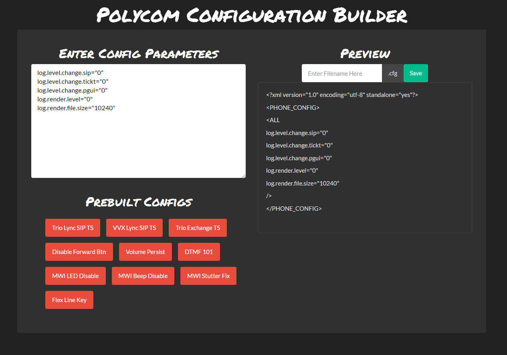

## Polycom Config Builder

Quickly type in and save new configurations all without having to pull up another editor. Commonly used configurations are clickable below for quick saving and editing. 

--Built using ReactJS
